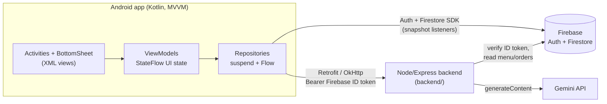

# CafeShop

An Android café ordering app with a Gemini-powered order assistant. Customers browse the
menu, build a cart, check out, and watch their order's status update live as staff prepare it.
Admins manage the menu, move orders through their lifecycle, reply to reviews and send
notifications. An **Ask AI** assistant answers menu questions, makes recommendations, helps
customise an order and looks up order status.

## Architecture



- **UI layer** (`ui/<feature>/`, activities in the root package): activities only render
  `StateFlow` state and forward user input. Flows are collected with
  `repeatOnLifecycle(STARTED)`, so nothing is collected while a screen is in the background.
- **ViewModels** expose immutable UI state plus one-shot events (toasts/navigation).
- **Repositories** (`data/repository/`) are interfaces with Firebase/Retrofit implementations:
  - one-shot reads/writes are `suspend` functions (`Task.await()` from
    `kotlinx-coroutines-play-services`);
  - live data (a customer's orders, a single order, all orders, the notification inbox) is a
    `callbackFlow` over a Firestore snapshot listener whose `ListenerRegistration` is removed in
    `awaitClose`, i.e. as soon as the screen stops collecting or its ViewModel is cleared;
  - multi-document writes (order + payment, status change + customer notification) are atomic
    `WriteBatch`es.
- **Cart** lives in `CartRepository` (an immutable `StateFlow<List<CartItem>>`), shared by the
  menu, cart and payment screens and cleared on every sign-in and sign-out.
- **DI** is a small hand-written `ServiceLocator`; ViewModels take interfaces, so unit tests
  pass MockK mocks instead.

```
app/src/main/java/com/example/cafeshopassignment/
├── *Activity.kt              screens (render state, forward input)
├── adapters/                 ListAdapter + DiffUtil RecyclerView adapters
├── data/
│   ├── firestore/            snapshot → Flow helpers, document → model mappers
│   ├── remote/               CafeApi (Retrofit), AuthInterceptor, RetrofitClient, DTOs
│   └── repository/           Auth, User, Menu, Order, Review, Notification, Cart, Chat
├── di/ServiceLocator.kt
├── models/                   MenuItem, Order, OrderStatus, CartItem, ChatMessage, ...
└── ui/                       ViewModels per feature, AI assistant bottom sheet, UI helpers
```

## Tech stack

- Kotlin 2.0, Android View/XML UI with Material Components 3, minSdk 24 / targetSdk 36
- MVVM: AndroidX ViewModel, `StateFlow`, Kotlin coroutines, `lifecycle-runtime-ktx`
- Firebase Authentication and Cloud Firestore (real-time snapshot listeners)
- Retrofit 2 + OkHttp 4 + Gson for the backend API
- Glide for images
- Tests: JUnit 4, kotlinx-coroutines-test, MockK, OkHttp MockWebServer
- Tooling: ktlint (via `org.jlleitschuh.gradle.ktlint`), `.editorconfig`, GitHub Actions CI

## Setup

1. **Android Studio**: a recent stable release with JDK 17 and Android SDK 36 installed.
   Open the repository root as a project.

2. **Firebase config**: `app/google-services.json` is intentionally *not* committed.
   - In the [Firebase console](https://console.firebase.google.com/), open (or create) the
     project, add an Android app with package name `com.example.cafeshopassignment`, and
     download its `google-services.json`.
   - Save it as `app/google-services.json`. It is git-ignored; never commit it.
   - `app/google-services.json.example` shows the expected shape (CI copies it into place so
     the build works without real credentials).
   - Enable **Email/Password** sign-in under Authentication, and create a Firestore database.
     The app uses the collections `users`, `menuItems`, `orders`, `payments`, `reviews` and
     `notifications`. The order and inbox queries need two composite indexes
     (`orders: userId ASC, createdAt DESC` and `notifications: recipientId ASC, createdAt DESC`);
     the Firestore error log links straight to their creation page on first run.
   - To make an admin account, set `role: "admin"` on that user's `users/{uid}` document.

3. **`local.properties`** (git-ignored, at the repository root). Android Studio adds `sdk.dir`
   for you; add the backend URL:

   ```properties
   sdk.dir=/path/to/Android/sdk
   # Where the app sends AI assistant requests. Must end in a slash.
   BACKEND_BASE_URL=http://10.0.2.2:3000/
   ```

   `BACKEND_BASE_URL` is compiled into `BuildConfig.BACKEND_BASE_URL`. Resolution order:
   `-PBACKEND_BASE_URL=...` / `gradle.properties` → `local.properties` → the
   `BACKEND_BASE_URL` environment variable → default `http://10.0.2.2:3000/`.

4. **Backend**: the AI assistant needs the Node/Express service in [`backend/`](backend/).
   Follow [`backend/README.md`](backend/README.md) to configure and start it (its environment
   variables, including the Gemini API key, are documented there).
   - **Emulator + local backend**: keep the default `http://10.0.2.2:3000/` (`10.0.2.2` is the
     emulator's alias for your machine's `localhost`).
   - **Deployed backend**: set `BACKEND_BASE_URL=https://your-backend.example.com/`.
   - Cleartext HTTP is only allowed to `10.0.2.2`/`localhost`
     (`res/xml/network_security_config.xml`); a physical device should talk to an HTTPS URL.

5. Run the `app` configuration, or from the command line:

   ```bash
   ./gradlew assembleDebug          # build
   ./gradlew testDebugUnitTest      # JVM unit tests (no device, no network)
   ./gradlew ktlintCheck            # lint; ./gradlew ktlintFormat fixes most issues
   ```

## The AI order assistant

Tap **Ask AI** (the floating button on the **Menu** and **Cart** screens) to open a chat
bottom sheet. The assistant can:

- **Answer menu questions**: "What's on the menu?", "Do you have anything vegan?"
- **Recommend** items: "Recommend something sweet", "What goes with a flat white?"
- **Help customise an order**: "Can I get my latte with oat milk?"
- **Check order status**: "Where's my latest order?"

How it works: the app sends `POST /api/chat` with the message, the last 20 turns of the
conversation and the user's id, authenticated with the user's Firebase ID token
(`Authorization: Bearer <token>`, fetched per request and force-refreshed once on a 401). The
backend verifies the token, gathers menu/order context and calls the Gemini API. Suggestion chips
provide one-tap prompts. Failures (offline, backend down, expired session, rate limiting, 5xx)
show as an inline error bubble; tap it to retry. The conversation is kept while you stay on
that screen, even if you close and reopen the sheet.

## Tests and CI

`app/src/test` holds JVM unit tests for the repositories and ViewModels: cart
add/increase/decrease/clear, clearing the cart on sign-in/out, Firestore mapping, order status
mapping, real-time listener emission and removal, atomic order/status writes, payment rules and
the double-tap guard, menu validation, the chat repository against a MockWebServer (success,
401, 429, 5xx, dropped connection, malformed or empty replies), the auth-token interceptor
(bearer header, refresh-and-retry-once) and the assistant ViewModel (history, loading, inline
errors, retry). Firebase and HTTP are mocked, so the tests make no real network calls.

[`.github/workflows/android-ci.yml`](.github/workflows/android-ci.yml) runs
`./gradlew ktlintCheck assembleDebug testDebugUnitTest` on JDK 17 for every push and pull
request (backend-only changes are skipped). [`.github/workflows/backend-ci.yml`](.github/workflows/backend-ci.yml)
does the same (`lint`, `build`, `test`) for `backend/`.

### Emulator screenshot tour

[`.github/workflows/android-emulator-screenshots.yml`](.github/workflows/android-emulator-screenshots.yml)
is a manually-triggered (`workflow_dispatch`) workflow that boots a real Android emulator on the
runner, walks the app through login → menu → cart → the Ask AI chat → checkout → order
confirmation → admin dashboard, and uploads a screenshot from each screen as a downloadable
workflow artifact. It's kept separate from the fast unit-test CI above because it needs live
credentials and takes several minutes (real emulator boot + a real Gemini call).

It needs three repo secrets (Settings → Secrets and variables → Actions):

| Secret | What it is |
|---|---|
| `GOOGLE_SERVICES_JSON_BASE64` | `base64 -w0 app/google-services.json` of your real Firebase config |
| `FIREBASE_SERVICE_ACCOUNT_JSON` | Same service account JSON used for `backend/.env` |
| `GEMINI_API_KEY` | Same Gemini key used for `backend/.env` |

The workflow creates two throwaway Firebase Auth users (`ci-customer-*@example.com`,
`ci-admin-*@example.com`) via `backend/scripts/ci/createTestUsers.ts` for the tour, and deletes
them afterward with `deleteTestUsers.ts` in an `if: always()` step — nothing test-related is
left in the live project. UI navigation is driven by `scripts/ci/ui-tour.sh`, which locates every
tap target from a live `uiautomator dump` (via `scripts/ci/uiautomator_bounds.py`) instead of
hardcoded pixel coordinates, so it isn't tied to one emulator resolution.

## Known limitations / follow-ups

- ~~Security rules are not in this repo~~ — `firestore.rules` (plus `firebase.json` /
  `.firebaserc` / `firestore.indexes.json`) is now committed and deployed. It enforces
  `users/{uid}` role checks server-side (a client can no longer self-promote to `"admin"`),
  matching the UI-level gating.
- **Rotate the old Firebase API key.** `google-services.json` used to be committed, so the key
  is still in git history. Restrict it (Android app + SHA-1) or rotate it in the Google Cloud
  console.
- **Payments are simulated.** The checkout validates card fields locally and records an order
  and payment in Firestore; no payment provider is integrated and no card data is stored.
- **Strings in XML layouts** are still hard-coded (all Kotlin-side strings are in
  `strings.xml`); a full localisation pass hasn't been done.
- **Admin menu form**: the category is a validated free-text field (it must match one of the
  four menu tabs) rather than a dropdown, and there is no image upload, so items added in the
  app have no picture.
- **Notification read state**: `isRead` is stored but there is no unread badge or mark-as-read.
- **Analytics card** on the admin dashboard is still a "coming soon" placeholder.
- **Assistant context**: the conversation lives in memory per screen (not persisted, not shared
  between the Menu and Cart screens), and the app doesn't send its local cart to the backend.
  `GET /api/menu` and `GET /api/orders/{id}` are declared in `CafeApi`, but the app's screens
  read menu and order data directly from Firestore. The backend's optional `orderId` chat field
  isn't sent yet (the backend already looks up the user's recent orders from `userId`).
- **Passwords are trimmed** before sign-in/registration, as the original app did, so existing
  accounts keep working.
- **Dependency injection** is a hand-written service locator; Hilt would be the next step if
  the app grows.
- **MVVM coverage**: every Activity has been moved onto a ViewModel and repositories, and none
  calls Firebase directly. The admin dashboard's recent-orders preview still builds its rows in
  code rather than using a RecyclerView.

## What to record for a demo

1. **Customer ordering**: log in, greeted by name on the **Menu**. Switch the Drinks /
   Breakfast / Lunch / Pastries tabs, tap **Add** on a couple of items, open the cart icon, use
   **+/−** to change quantities and watch the total update.
2. **Ask AI**: on the Menu (or Cart), tap **Ask AI**. Tap the "What's on the menu?" chip, then
   type "Recommend something sweet to go with a latte", then "Can I get my latte with oat
   milk?". To show error handling, briefly stop the backend, send a message, then restart it
   and tap the error bubble to retry.
3. **Checkout and live tracking**: tap **Place Order**, apply promo code `THIRSTY`, pay (demo
   card `4242 4242 4242 4242`, `1229`, `123`). The confirmation screen shows **Live order
   status: Pending**. On a second emulator logged in as an admin (or by editing the order's
   `status` in the Firestore console), move it to *Preparing* then *Ready for Collection*; the
   customer's badge and progress bar update within a second, with no refresh.
4. **Admin tools**: log in via **Admin Login** to see the dashboard's live stats and recent
   orders. Open **Manage Menu** to add an item (try an invalid category to show validation),
   edit a price and delete it. Open **View More Orders** to filter by status, search by
   customer name and update a status (the customer gets an inbox notification). Optionally
   reply to a review under **View Feedback**.
5. **My Orders + inbox** (customer): open the receipt icon on the Menu to show the order list
   updating live, then the mail icon to show the status-update notifications that arrived.
